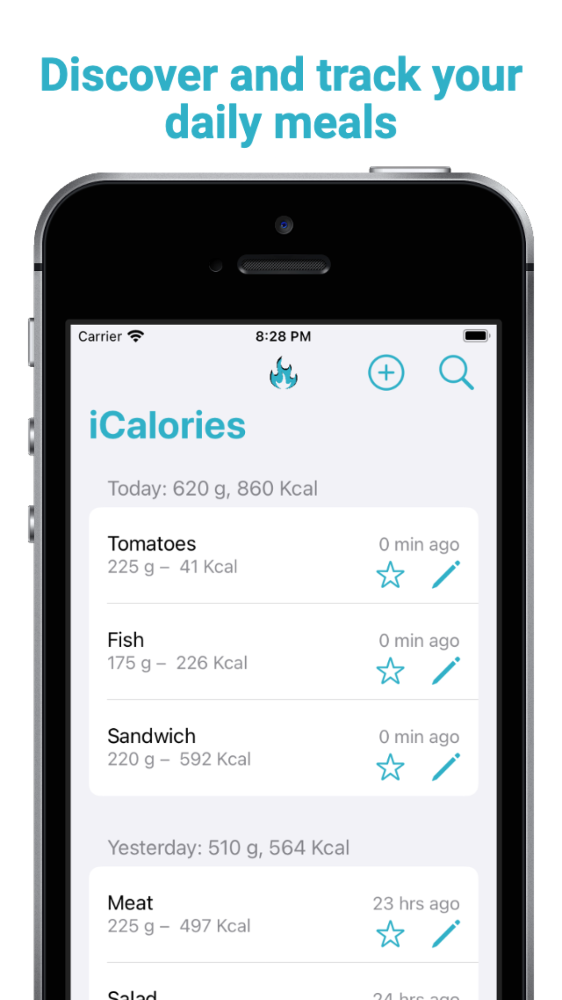
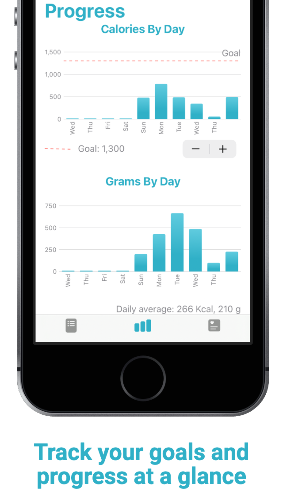
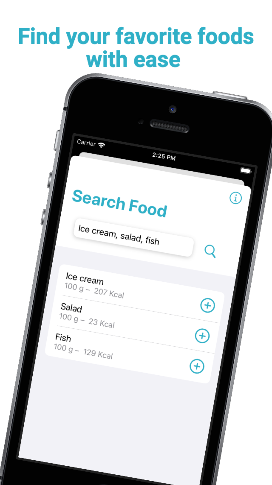
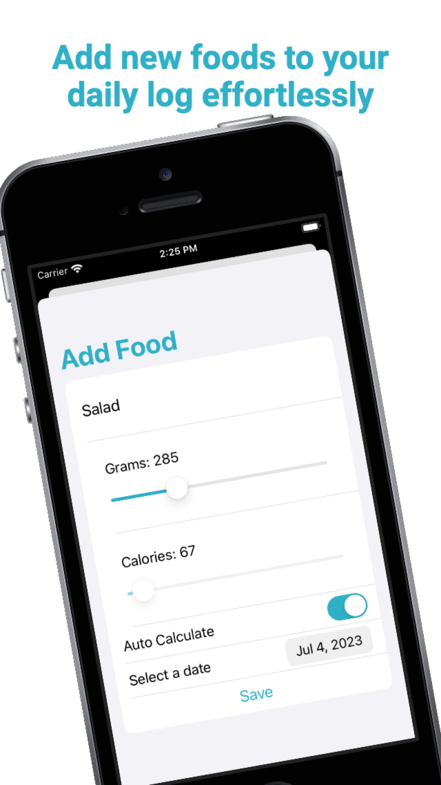
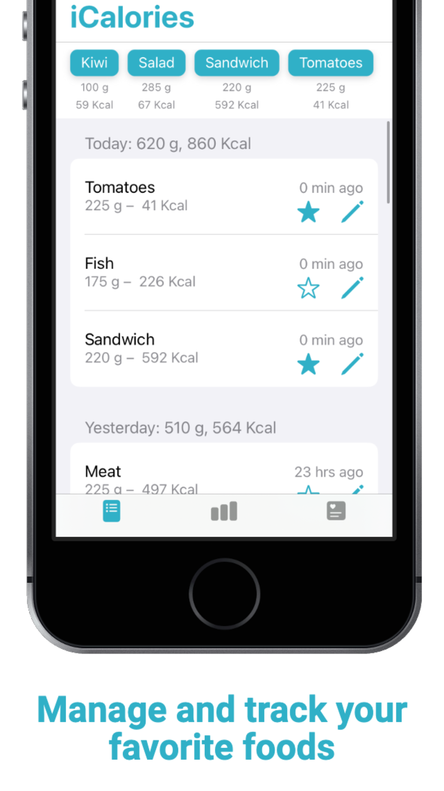
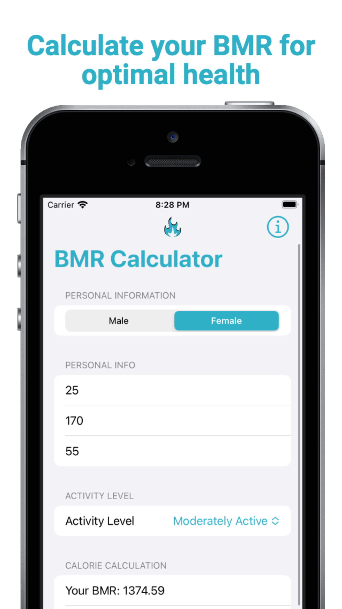

# iCalories

iCalories is a simple iOS app that helps users track their food consumption and monitor their calorie intake. With iCalories, you can easily add food items and keep a record of your daily food intake.

## Features

- **Food Tracking**: Add food items to track by entering their name, grams, and calories. The app provides sliders for selecting the values of grams and calories, making it quick and intuitive to add food items.

- **Auto Calculation**: Toggle the auto-calculation feature if you know the calorie-to-gram ratio for a particular food item. The app automatically calculates the calories based on the grams entered, saving you time and effort.

- **Date Selection**: Assign a specific date to each food entry to keep track of when you consumed it. The app includes a date picker for easy selection of the desired date.

- **BMR Calculation**: Calculate your Basal Metabolic Rate (BMR) to determine the number of calories your body needs at rest. This feature helps you set personalized calorie goals for effective calorie tracking.

- **Core Data Integration**: All food entries are stored using Core Data, a powerful and efficient data persistence framework provided by Apple. This ensures that your food diary is saved and can be accessed even when the app is closed.

- **API Integration**: iCalories integrates with the CalorieNinja API to provide additional information about food items, such as serving size, fat content, protein, sodium, and more.

- **Progress Tracking**: Monitor your calorie intake progress over time with interactive charts. The app visualizes your calorie and grams consumption to help you stay on track and achieve your goals.

## Screenshots

  
<br>
  

## Getting Started

To get started with iCalories, follow these steps:

1. Clone the repository to your local machine.
2. Open the project in Xcode.
3. Build and run the app on the iOS simulator or a physical device.

## Requirements

- iOS 16.0 or later
- Xcode 14.0 or later
- Swift 5.0 or later

## Reminder

**Obtain an API Key from CalorieNinja API**

1. Go to the CalorieNinja website in your web browser.
2. Sign up for an account or log in if you already have one.
3. Navigate to your account/API settings page.
4. Find your API key provided on that page.

**Add the API Key to the iCalories app**

1. In the Xcode project navigator, locate the "Helpers" folder.
2. Create a new file called "Secrets.swift" in the "Helpers" folder.
3. Open the "Secrets.swift" file and add the following code, replacing "YOUR_API_KEY" with your actual API key:

```
let apiKey = "YOUR_API_KEY"
```

Remember to keep your API key confidential and avoid sharing it publicly.
